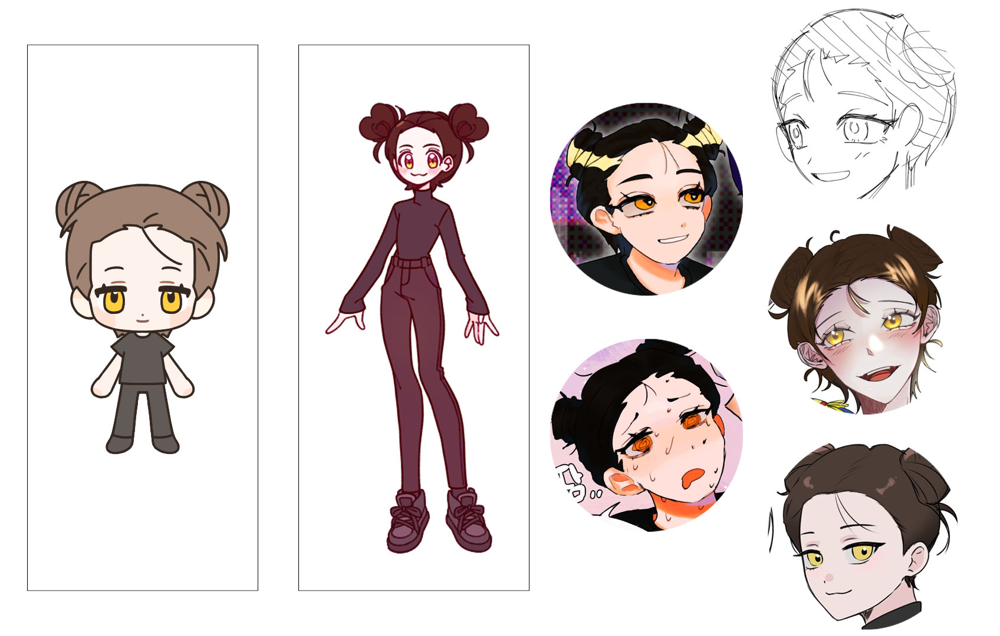

<!DOCTYPE html>
<html lang="ko">
<head>
    <meta charset="UTF-8">
    <meta name="viewport" content="width=device-width, initial-scale=1.0">
    <title>그레이XE</title>

    <link rel="preconnect" href="https://fonts.googleapis.com">
    <link rel="preconnect" href="https://fonts.gstatic.com" crossorigin>
    <link href="https://fonts.googleapis.com/css2?family=Sunflower:wght@300;500;700&display=swap" rel="stylesheet">
    
    
</head>
<body>
    <h1>드림 설정표, 자료</h1>
      
    <h3>1. 그레이(시쿄인 히비키)</h3>
    <a href="https://namu.wiki/w/%EC%8B%9C%EC%BF%84%EC%9D%B8%20%ED%9E%88%EB%B9%84%ED%82%A4">자세히</a>
    

     
    <h4>그레이 옷차림</h4>
    

    

     
    <h4>그레이 사복</h4>
    

    

    

      
    <h3>2. E(드림주)</h3>
    

     
    <h4>E 옷차림</h4>
    

</body>
</html>
